Locked Vault
-----------------
We were given a compressed file `LockedVault.tar.gz`. Nothing else ;).

### Approach:

- I saw a tar file, and instinctively unpacked it and saw its contents.

    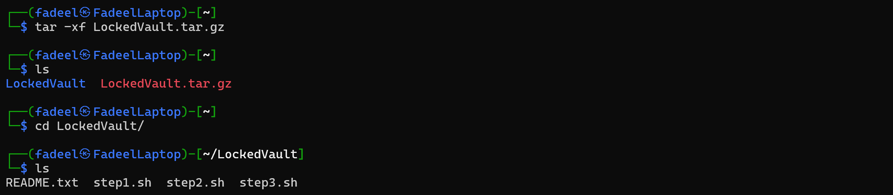

- A `README.txt` is staring at my face. So I read it.

    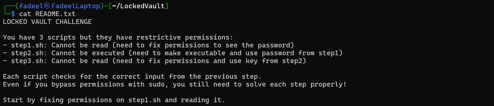
    Looks like we got to follow some steps.

- Fixing `step1.sh` and running it

    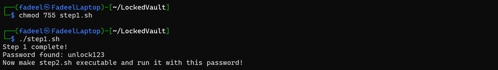

- Fixing `step2.sh` and running it

    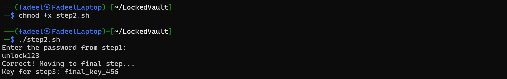

- Fixing `step3.sh` and running it

    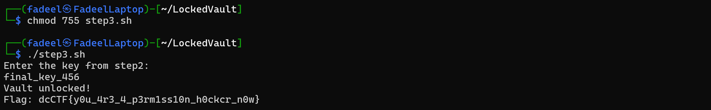
    And there we have the flag!

### Learnings
- Opening a tar file
- Changing permissions of files

---

Git Gud
----------------
We were given a compressed file `git_forensics_challenge.zip`.

### Approach

- I unzipped the file in Windows and transferred the folder to Linux (I use WSL).
- Explored a bit

    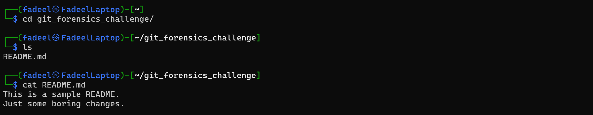
    Hmm, so `README.md` is useless.    

- Then I thought. People use git to commit and push files. So maybe a file containing the flag was added and then removed? So I checked the commit log using `git log`

    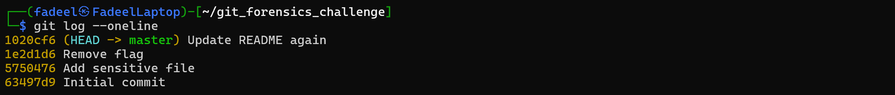
    There I see it! A commit saying `Add sensitive file`.

- Then I listed the files in that commit

    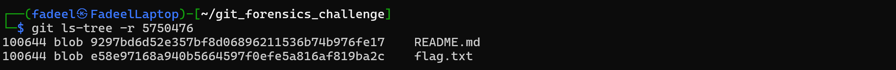
    Our file of interest - `flag.txt`

- Viewed the contents of the file using `git show`

    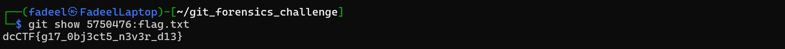
    Voila! The flag.

### Learnings
- Git commit logs are saved and can be checked.
- Even deleted files are saved. So they can be viewed.

---

Event Digger
--------------
This string somehow encodes the flag. Find it dmFyIGV2ZW50cyA9IFs2OCwgNjcsIDY3LCA4NCwgNzAsIDIxOSwgNzQsIDgzLCAxODksIDcwLCA0 OSwgNjUsIDcxLCAyMjFdCg==

hint: The name of the challenge is a hint, also which language's syntax does this seem to be?

### Approach

- As soon as I saw the string, it occured to me that it is base64 encoded (have some experience with base64 encoding). So I decoded it.

    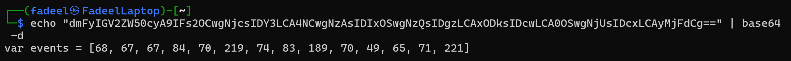

- After this, I wasn't sure what to do with the list of integers I got. Naturally, I tried ASCII. The first 5 integers correspond to `DCCTF`, and I got confident about it being ASCII. But then I saw that a few of the integers don't correspond to alphanumeric.

    I kind of got stuck at this point. So I sought some help from the Organizer. They confirmed that it was not ASCII, and also told me to look at the hint.

    But I still could not get it. What could the name 'Event Digger' have to do with this? After some searching, I discovered JavaScript event codes. So I tried matching the numbers, and the $6^{th}$ number came out to be `{`. Nice! Matched the rest, and got my flag as `DCCTF{JS-F1AG}`.


### Learnings
- Got to know about JavaScript event codes :)

---

Bring Back from the Dead
-----------------
Received a file `challenge.img`. The name is self-explanatory.

### Approach
- It is a `.img` file. So I tried mounting it and checked the folder contents.

    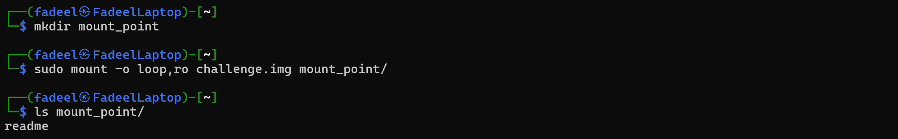
    Found a `readme`

- Let's check the file

    
    Nothing here

- I didn't know what to do at this point. So I searched about deleted file recovery, and found out about `photorec`.

    
    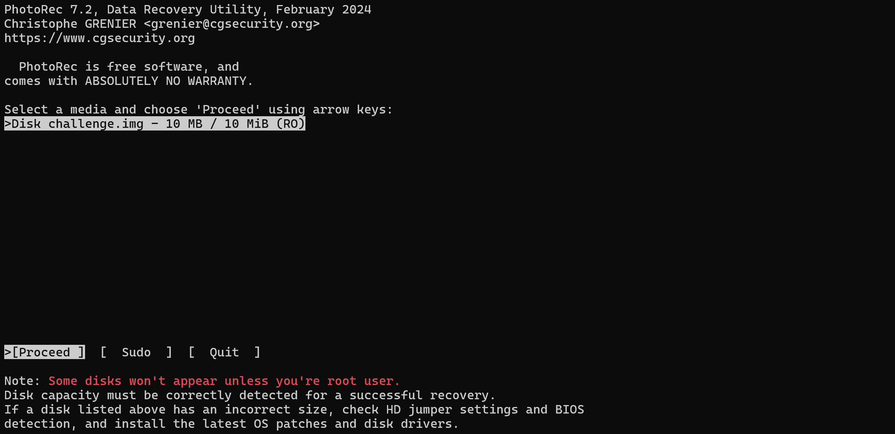
    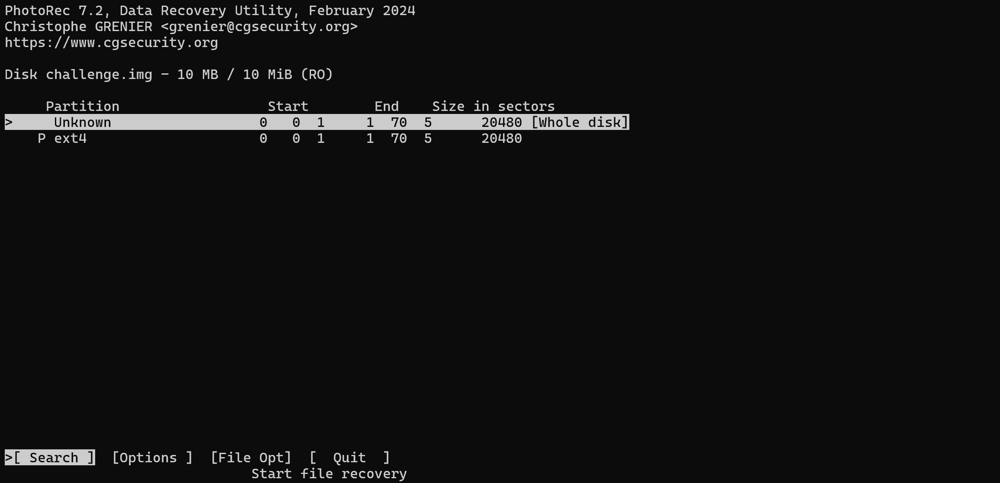
    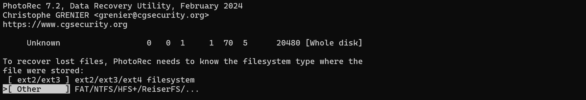
    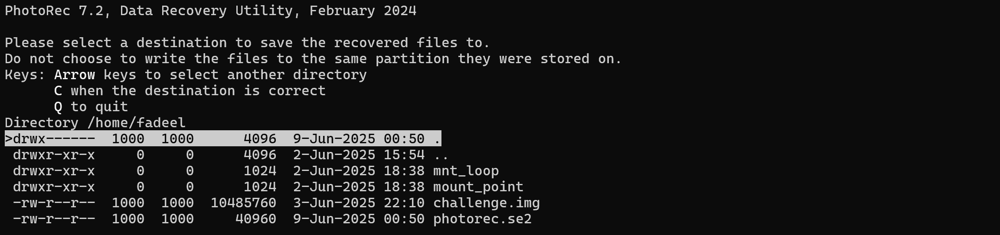
    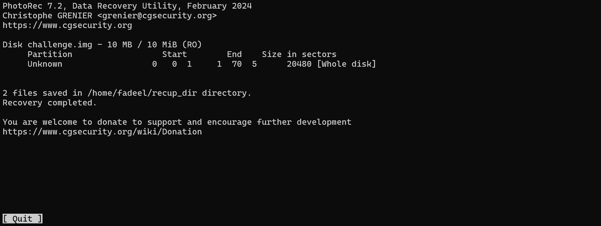

- Checked the recovery folder

    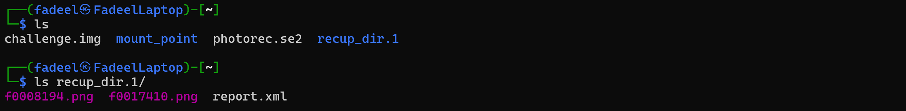
    Found two `.png` files

- Then I accessed the files through Windows. And this is what it was:

    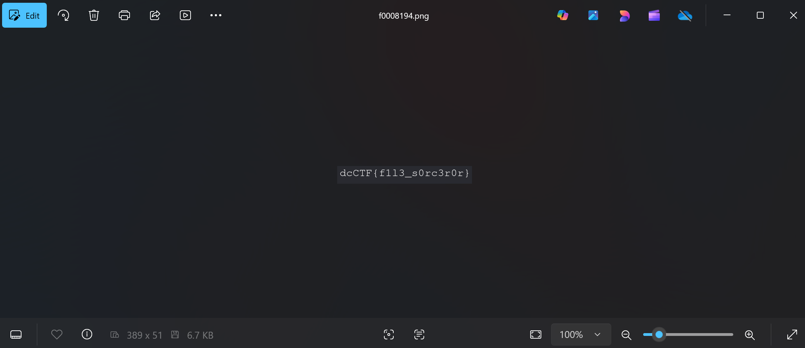


### Learnings
- You can recover deleted files \*_*.
- `photorec` is meant specifically for this.

---

Binary Directory
------------------
We were given a file `chal.tar.xz`. Can you use your scripting skills to solve this challenge?

### Approach

- Again, a tar file.

    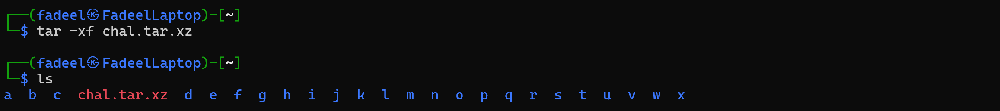
    That's a mess!

- Exploring a bit

    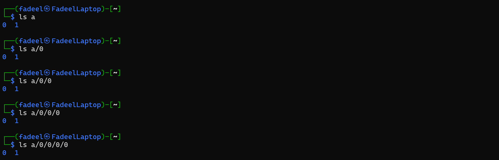
    An even bigger mess. There are nested folder's with names `0` and `1`, inside all the folders `a` to `z`.
    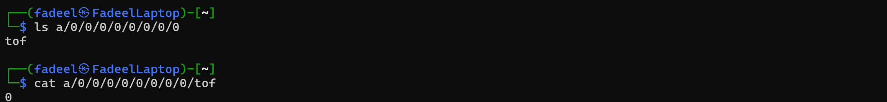
    Finally, found a file, containing `0`.

- I need to check every folder and file, but I cannot do this manually. So I wrote a bash script.

    ```bash
    #!/bin/bash

    for dir in {a..x}; do
        if [[ -d "$dir" ]]; then
            find "$dir" -type f | while read -r file; do
                echo "Found content in: $file"
                cat "$file"
                echo
            done
        fi
    done
    ```
    When I ran this, I got a lot of files (of course, because there are $24 \cdot 2^{8}$ directories), and I cannot show them here. But I noticed something: Almost all the files contain `0`, and a few contain `1`.
    So let's check the path of every file containing `1`. I ran the following modified script.
  
    ```bash
    #!/bin/bash

    for dir in {a..x}; do
        if [[ -d "$dir" ]]; then
            find "$dir" -type f | while read -r file; do
                trimmed=$(tr -d '[:space:]' < "$file")
                if [[ "$trimmed" == "1" ]]; then
                    echo "$file"
                fi
            done
        fi
    done
    ```
    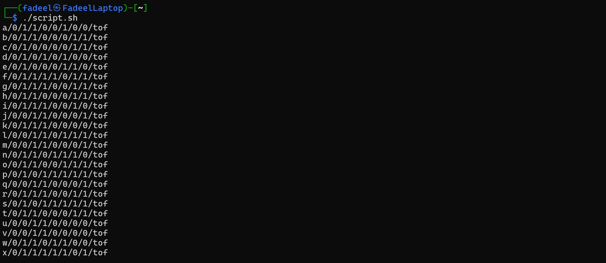

- I saw it right away. The directories contain 8 bits, corresponding to a character. I manually looked up the ASCII table, and got this.

    ```
    01100100 -> d
    01100011 -> c
    01000011 -> C
    01010100 -> T
    01000110 -> F
    01111011 -> {
    01110011 -> s
    01100011 -> c
    01110010 -> r
    00110001 -> 1
    01110000 -> p
    00110111 -> 7
    00110001 -> 1
    01101110 -> n
    01100111 -> g
    01011111 -> _
    00110001 -> 1
    01110011 -> s
    01011111 -> _
    01100011 -> c
    00110000 -> 0
    00110000 -> 0
    01101100 -> l
    01111101 -> }
    ```

    Giving the flag `dcCTF{scr1p71ng_1s_c00l}`

### Learnings
- Some bash scripting

---

Dumpster Diver
--------------------
Sorry, I do not have the original `program` file which we got, and have now forgotten completely how I did this.

---

Log Explore
--------------------
Sorry, I am not able to generate the `log.txt` file using the given `logGen.cpp`. Says there are integer overflow errors in the C++ code.

---

Welcome Agent, Hidden in the Crowd, Process Hunter
--------------------
Sorry, I do not have experience with Dockerfiles.