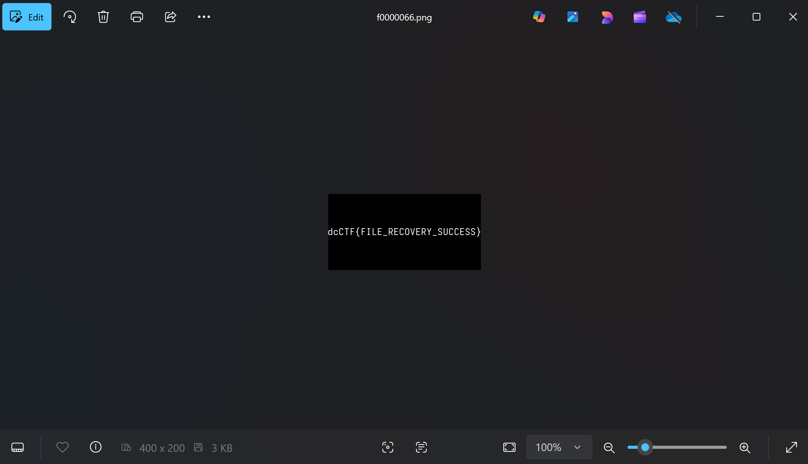

## Network Intrusion
>A network intrusion has been detected! Security analysts captured network traffic during the incident, but they need your help to analyze what happened.

I know this was supposed to be done using Wireshark and not like this, but anyway.

Used `strings network_capture.pcap` and found some suspicious text.


Recognized it as base64, and decoded it.


---

## Evidence Disk
>A disk image has been captured from the suspect's machine. Your task is to find the hidden flag

Just did `photorec disk_image.dd`, which gave a recovery folder.


Found multiple images. Opened them one by one. A few were decoys, but eventually found the flag.



---

## Weak RSA
>The larger the primes used in rsa, the stronger it is.

Factored the given `n` using https://www.alpertron.com.ar/ECM.HTM.

Then wrote this code to find `d` and the original message.

```python
from sympy import mod_inverse

p = 219920443573698782845930677192261022747
q = 262725443219511029142449525203053232189
e = 65537
c = 19759948204827148967716452284363638954256347121332992994807595069379938069646

n = p * q
phi = (p - 1) * (q - 1)
d = mod_inverse(e, phi)
m = pow(c, d, n)

num_bytes = (m.bit_length() + 7) // 8
message_bytes = m.to_bytes(num_bytes, 'big')

message = message_bytes.decode('utf-8')
print(message)
```

Ran this and got `dcCTF{W34k_RSA_1s_N0_G00D}`.

---

## Fair Enough
>Wrap the result in dcCTF{} and submit. The encrypted message is:
ERQDUBDTZUQFDOMHLFGT

Looking at the cipher, I immediately recognized it as Playfair. But we need a key to decode it.

So I went to https://www.dcode.fr/playfair-cipher and did dictionary attack (common keys/grids).
Turned out that the key grid was simply ABCDE...

Decoded message: `BUTAREYOUPLAYINGFAIR`

---

## XOR
>I encypted this message via a very strong function, Its so strong I don't even have to remember a long key! <br> 17022d30351a0a541d35313640110b25073e1654211c

I know that the first 6 characters must be `dcCTF{`. So I XORed the first 6 numbers of the cipher (`17, 02, 2d, 30, 35`; this is hex, converted to decimal) with the ASCII of `dcCTF{`, and it came out to be `sandsa`. I guessed that maybe the word `sand` is recurring. Tried this, and it worked.

Decoded message: `dcCTF{d0nT_R3peAt_x0R}`

---

## Oui Oui Secret
>A cryptographer's secret has been discovered. But alas he died and could not tell us the key. <br> The intercepted transmission contains: <br> geMRX{sry_ngv_jrw_lpmehhypup_wjsq}

From the name of the challenge (Oui if French for Yes), I guessed that this is Vigenère cipher. And again, I know that the first 5 characters are `dcCTF`.
Using that, I got that the first five characters of the key is `dckys`.

Then I went to https://www.dcode.fr/vigenere-cipher and used the partial key option. It gave `dcCTF{how_did_you_bruteforce_this}` with key `dckysl`.

---

## Classic Caesar
>The ancient Roman general has returned with a new message. His cipher technique hasn't changed much over the centuries. <br> Decode the message to find the flag! <br> gfFWI{FDHVDU_QHYHU_GLHV}

Got the shift as 3 just by inspection.

Decoded message: `dcCTF{CAESAR_NEVER_DIES}`

---

## Hidden in Plain Sight
> A seemingly innocent image contains a secret message.

Just need to bruteforce the passphrase using `rockyou.txt`.


---

## Chameleon Image
> An image has been discovered that appears to be more than meets the eye.

Direct `binwalk` solves it.


---

## Sound of Secrets
>Listen carefully to this mysterious audio file... or should you? Can you find the true message hidden within? <br> When you find the message, wrap it in dcCTF{} to submit as the flag.

Generated spectrogram using https://convert.ing-now.com/audio-spectrogram-creator/.


Noticed morse code on the top and bottom.  
Bottom reads: `DECOY`
Top reads: `R34LFL4G`

---

## Learnings

- `photorec` for disk image recovery
- How to break weak RSA
- `stegseek` can be used to bruteforce passphrase to extract hidden files
- `binwalk` can be used to search for data in binary files

